
成为海盗，获取盗版资源，并不是不光彩的事情。当今我们身处的世界，文艺被垄断巨头掌握并充满DRM和审查，此时适当地获取盗版，把钱用在刀刃上，支持自己喜欢的独立作者，不失为一种反抗。而获取盗版资源，<strong>点对点下载</strong>是最重要的方式之一。

不过，在很多发达国家，尤其是欧盟、北美、日本，成为海盗也会有法律风险，有的地区甚至可能入罪。

<h2 id="选择协议">选择协议</h2>

当今流行的点对点下载协议有两类：

<ul>
<li>BitTorrent/Magnet</li>
<li>eMule</li>
</ul>

前者是大名鼎鼎的“BT下载”和衍生出来的“磁力链”。后者则是“电骡”，在中文互联网上，“电驴”这个名字可能流传更广。至于“电驴”、“电骡”、VeryCD等等，背后又是一段冗长的历史，这里不再赘述。鉴于eMule相比前者已经式微，所以我们在这里选择<strong>BitTorrent/Magnet</strong>。

<h2 id="软件推荐">软件推荐</h2>

可以进行BitTorrent/Magnet下载（以下均简称BT下载）的软件有很多，随手就可以列出一些：

<ul>
<li><a href="https://www.utorrent.com/">µTorrent</a></li>
<li><a href="https://transmissionbt.com/">Transmission</a></li>
<li><a href="https://deluge-torrent.org/">Deluge</a></li>
<li><a href="https://www.qbittorrent.org/">qBitTorrent</a></li>
<li><a href="https://www.bitcomet.com/en">BitComet</a></li>
<li><a href="https://www.xunlei.com/">XunLei</a></li>
</ul>

其中最后一个：迅雷，是我们最大的敌人，因为他会从别处“<a href="https://en.wikipedia.org/wiki/Glossary_of_BitTorrent_terms#Leech">吸血</a>”。BT的工作原理是“人人为我，我为人人”，也即，从别处下载之后，会上传给还没下载完成的其他用户。而“吸血”者会只下载，不上传，为大家所唾弃。

而qBitTorrent既是开源的，还有一个<a href="https://github.com/c0re100/qBittorrent-Enhanced-Edition">修改后的fork</a>，可以有效识别迅雷、QQ旋风等吸血客户端，还可以一键屏蔽未知的BT客户端（吸血者一般都会故意不填写自己的客户端名称和版本号）。因此，这里就选择qBitTorrent的这个加强版来介绍：

<a href="https://github.com/c0re100/qBittorrent-Enhanced-Edition/releases">Github上的最新下载地址</a>

4.4.0.10版本的下载地址（可能不是最新）：

<ul>
<li><a href="https://github.com/c0re100/qBittorrent-Enhanced-Edition/releases/download/release-4.4.0.10/qbittorrent_enhanced_4.4.0.10_x64_setup.exe">Windows(x64)</a></li>
<li><a href="https://github.com/c0re100/qBittorrent-Enhanced-Edition/releases/download/release-4.4.0.10/qBittorrent-Enhanced-Edition.AppImage">Linux(AppImage)</a></li>
<li><a href="https://github.com/c0re100/qBittorrent-Enhanced-Edition/releases/download/release-4.4.0.10/qBittorrent_enhanced-4.4.0.10.dmg">macOS</a></li>
</ul>

而安装的话，没什么好说的，因为只需要点击下一步就可以了。

<h2 id="软件配置">软件配置</h2>

配置菜单在这里打开：

<a class="image" target="_blank" href="index.assets/image-20220125232406974.png">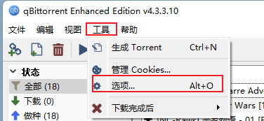</a></a>

首先开启屏蔽吸血客户端的高级功能：

<a class="image" target="_blank" href="index.assets/image-20220125232516412.png">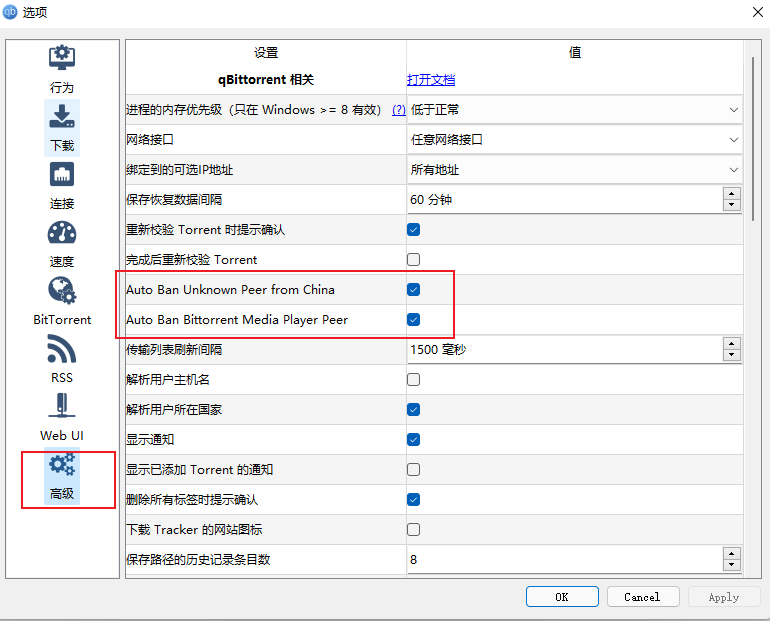</a>

然后是一些跟BT协议相关的配置，为了能够查找到更多用户，我们需要把能用的查找用户的功能打开：

<a class="image" target="_blank" href="index.assets/image-20220125232645451.png">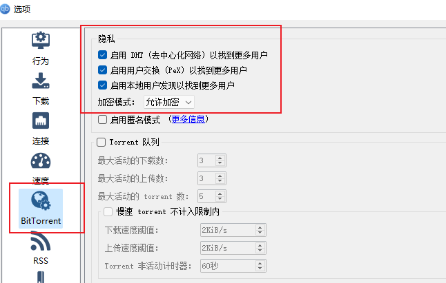</a>

最后需要添加一些tracker服务器。

我先稍微解释一下什么是tracker服务器。前面已经说了，BT下载的本质是“人人为我，我为人人”。而bt文件和磁力链其实是所要下载的文件的“指纹”，我们需要在“广场”上吼出这句指纹，好知道谁拥有这份文件，以互通有无。而tracker服务器就是这样的“广场”。很多bt文件和磁力链接都会自带一个tracker服务器列表，但是这种东西终究是多多益善；而且，有些磁力链接没有没有附带tracker服务器列表，这个时候我们只能通过DHT这样的点对点协议寻找拥有同款资源的道友，而这个过程如同在黑暗中一样慢慢摸索。

Github上有<a href="https://github.com/ngosang/trackerslist">一个很好用的公共tracker服务器列表</a>。我们只需要把<a href="https://raw.githubusercontent.com/ngosang/trackerslist/master/trackers_all.txt">这个文件</a>里面的内容，复制到我们的qBitTorrent配置里面就可以了：

<a class="image" target="_blank" href="index.assets/image-20220125233645126.png">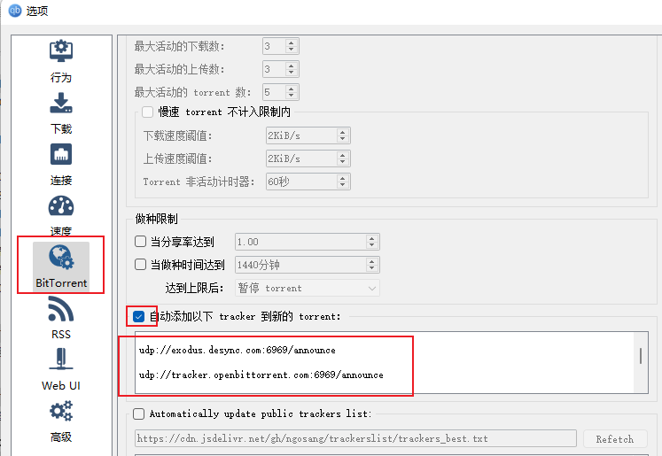</a>

<h2 id="如何下载">如何下载</h2>

最知名的盗版资源站莫过于<a href="https://thepiratebay.org/index.html">海盗湾</a>。以上个月的大烂片<em>The Matrix Resurrections</em>为例，检索之后很快就能得到结果，然后，右击磁铁标志复制，即可获得磁力链接。

<a class="image" target="_blank" href="index.assets/image-20220125234121125.png">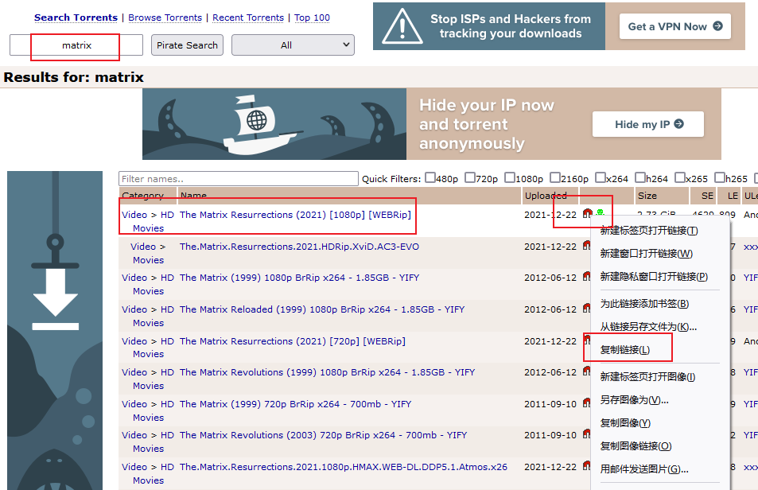</a>

接着，打开qBitTorrent，添加磁力链接：

<a class="image" target="_blank" href="index.assets/image-20220125234220438.png">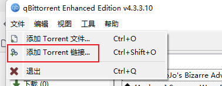</a>

<a class="image" target="_blank" href="index.assets/image-20220125234248041.png">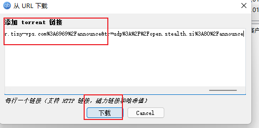</a>

最后选择要把文件保存在哪里，再点击OK，下载应该就会开始了。

<a class="image" target="_blank" href="index.assets/image-20220125234341257.png">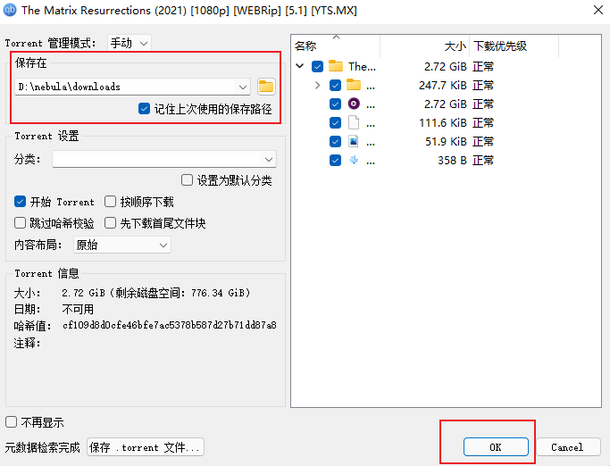</a>

当然，如果是冷门资源，有可能出现下载迟迟无法开始，或者速度很慢的情况，这时只能祈求上苍了。

另外还有一种邪道方式，很多国内网盘都提供磁力链离线下载功能，如果有人在国内网盘上传过这个文件而且还没有被审查的话，就可以直接用网盘下载了：

<a class="image" target="_blank" href="index.assets/image-20220126000206045.png">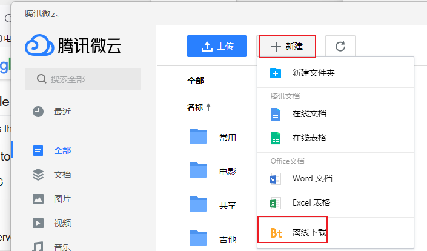</a>

<a class="image" target="_blank" href="index.assets/image-20220126000235228.png">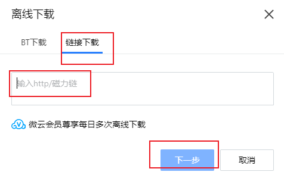</a>

<h2 id="怎么寻找资源">怎么寻找资源</h2>

除了前面说的海盗湾以外，<a href="https://www.proxyrarbg.org/index80.php">RARBG</a>也是不错的去处。如果是动画或者ACG相关的资源，欧美字幕组会发在<a href="https://nyaa.si">nyaa.si</a>，而国内字幕组也出没在<a href="https://share.dmhy.org/">动漫花园</a>。

另外，谷歌其实也很有用。用中文电影名+“磁力链”作为关键字检索，就可以获得海量结果。一般，如果是英语网站，提供磁力链就会被版权方发DMCA，导致资源被谷歌移除。但是，中文资源就是法外之地了：

<a class="image" target="_blank" href="index.assets/image-20220125235529014.png">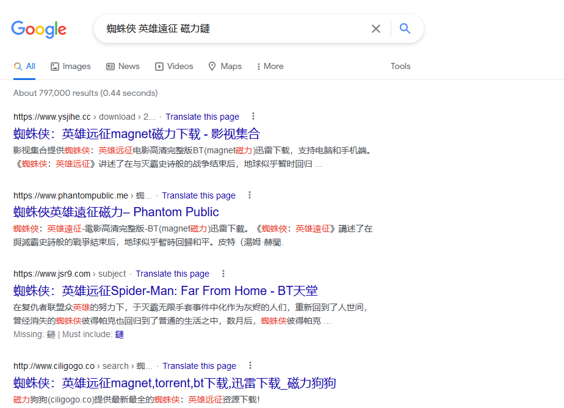</a>

不过网络资源良莠不齐，还是注意鉴别为妙。

