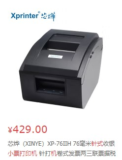

之前有两个分别叫喵喵机和咕咕机的热敏打印机产品，里面最有趣的功能就是传纸条。可是喵喵机的传纸条功能不知道为什么下线了，产品主打变成了学生错题打印机。不过这个功能也不难实现，所以这里就用Telegram机器人和POS打印机自己做一个。

<a href="./1.jpg" target="_blank"></a>

## 申请Telegram机器人

首先打开[BotFather](http://t.me/BotFather)，用`/newbot`命令申请创建机器人，如图：

<a href="./2.jpg" target="_blank"></a>

输入完名字和ID之后会得到一个令牌（token），需要存下来。

## 选购POS打印机

市面上的POS打印机以热敏打印机为主。但是热敏打印机有两个缺点：

1.  热敏纸上的涂层是一种低毒材料
2.  热敏纸过几周之后就会褪色

但是好处是便宜：

<a href="./3.jpg" target="_blank"></a>

此外还有针式的小票打印机，只需要普通纸带，也不会褪色，常用于发票打印。可价格却也高出不少：

<a href="./4.jpg" target="_blank"></a>

具体选哪种就见仁见智了。这些打印机都是通过USB口和计算机连接，在软件层面看都是一样的。

## 测试打印机

这里我选了在Linux操作系统下使用打印机。因为Linux比较适合嵌入式系统，可以用树莓派这样的低功耗单板电脑。此外，Linux内核里面是自带[USB打印机驱动](https://github.com/torvalds/linux/blob/master/drivers/usb/class/usblp.c)的，比Windows还要方便。用USB线把打印机连接到电脑上之后，用dmesg命令可以查看设备信息：

```
$ sudo dmesg |grep -i printer
[  2.249791] usb 2-2.1: Product: USB PRINTER
[  2.249792] usb 2-2.1: Manufacturer: Printer
[  3.826349] usblp 2-2.1:1.0: usblp0: USB Bidirectional printer dev 4 \
             if 0 alt 0 proto 2 vid 0x0483 pid 0x070B
```

如上述命令所示，新增了usblp0的打印机设备。此时`/dev/usb`目录下也会出现一个字符设备：

    $ ls -l /dev/usb/
    total 0
    crw-rw---- 1 root root 180, 0 Aug 29 05:16 lp0

然后把这个设备的所有者改成成自己：

    $ sudo chown $USER:$USER /dev/usb/lp0 

向这个字符设备中输入文本就可以开始打印了：

    $ echo "The quick brown fox jumps over the lazy dog." > /dev/usb/lp0

如果需要输入中文的话要留意，现在国内的热敏打印机大部分都是只支持GBK字符集的，需要做编码转换：

    $ echo "我能吞下玻璃而不伤身体。" | iconv -i utf-8 -t gbk > /dev/usb/lp0

操作系统重启之后设备的所有者会恢复成root，需要修改udev配置:

```
$ echo -e KERNEL=="lp0", \
          SUBSYSTEM=="usbmisc", \
          ACTION=="add", \
          OWNER="$USER", \
          GROUP="$USER" \
    | sudo tee -a /etc/udev/rules.d/99-perm.rules
```

## 编写Telegram机器人

写Telegram机器人的话还是Python糊起来最容易！

首先下载Telegram机器人库：

    $ sudo pip3 install python-telegram-bot

本来讲道理应该用virtualenv之类的工具，不过我这里图省事直接全局安装了。

然后是代码：

    # 这里需要改成之前申请的令牌
    TOKEN='xxxxxx'

    import logging
    from time import localtime, strftime
    from telegram import ForceReply, Update
    from telegram.ext import Updater, CommandHandler, MessageHandler, Filters

    logging.basicConfig(
        format='%(asctime)s - %(name)s - %(levelname)s - %(message)s',
        level=logging.INFO
    )

    def printer_output(content):
        # 需要以GBK编码打开设备文件
        with open('/dev/usb/lp0', 'w', encoding='gbk') as fp:
            fp.write(content)

    def start(update, context):
        user = update.effective_user
        update.message.reply_text('来传纸条吧！')

    def print_msg(update, context):
        if update.message.text is None or update.effective_user is None:
            update.message.reply_text('错误: 不支持的消息类型')
            return
        user = update.effective_user
        name = user.first_name
        if user.last_name is not None:
            name = name + ' ' + user.last_name
        # 忽略名字里面的非GBK字符
        # 或者可以遍历一下字符串，把非GBK字符变成口口口
        name = name.encode("gbk", errors='ignore').decode("gbk")
        if user.username is not None:
            name = name + ' @' + user.username
        content = '-------------------------\n'
        content = content + 'from: ' + name + '\n'
        content = content + 'date: ' + strftime("%Y-%m-%d %H:%M:%S", localtime()) + '\n\n'
        content = content + update.message.text
        content = content + '\n-------------------------'
        content = content + '\n\n\n\n'
        try:
            printer_output(content)
        except Exception as e:
            update.message.reply_text('纸条传送失败: ' + str(e))
            return
        update.message.reply_text('已送达')

    if __name__ == '__main__':
        updater = Updater(TOKEN)
        dispatcher = updater.dispatcher
        start_handler = CommandHandler('start', start)
        dispatcher.add_handler(start_handler)
        dispatcher.add_handler(MessageHandler(~Filters.command, print_msg))

        updater.start_polling()
        updater.idle()

因为国内的网络问题，机器人没有办法直接连上Telegram的API服务器，所以这里要用代理，最方便的是proxychains-ng：

    # RedHat系：
    $ sudo yum install proxychains-ng

    # Debian系
    $ sudo apt-get install proxychains-ng

然后修改配置文件
/etc/proxychains.conf，在ProxyList这一节加上你的代理地址和端口，例如socks5一般是用localhost的1080端口：

    [ProxyList]
    # add proxy here ...
    # meanwile
    # defaults set to "tor"
    socks5  127.0.0.1 1080

最后运行机器人：

    $ proxychains -q python3 bot.py

顺利的话，一个可以传纸条的打印机应该就已经可以工作起来了。

## 总结和进阶

到这里，这个传纸条的功能还很有限，只能打印GBK编码的字符文本，如果需要更复杂功能，可以看一下[python-escpos](https://github.com/python-escpos/python-escpos)。市场上几乎所有的POS打印机都是用ESCPOS协议和计算机交互的。利用ESCPOS协议中的图片打印功能，可以打印条形码、二维码、图片，都是可以实现的。

对于UTF-8编码的文本，如果包含韩文、emoji等不属于GBK字符集的字符，也可以用图片打印的功能来间接实现：自己先在电脑上渲染成图片，然后再打印。

